# Edge Functions — Documentação Técnica

> Gerado automaticamente em 2026-03-17. Total: **90 funções**.

---

## Índice

- [Diagrama de Dependências](#diagrama-de-dependências)
- [1. Propostas (proposal-*)](#1-propostas)
- [2. WhatsApp (evolution-*, wa-*, send-wa-*)](#2-whatsapp)
- [3. Sync & Cron (monitoring-sync, meta-ads-sync, etc.)](#3-sync--cron)
- [4. Billing & Payments](#4-billing--payments)
- [5. IA & Copilot](#5-ia--copilot)
- [6. Admin & Tenant](#6-admin--tenant)
- [7. Energia & Monitoramento](#7-energia--monitoramento)
- [8. Fiscal & NF](#8-fiscal--nf)
- [9. Utilitários & Outros](#9-utilitários--outros)
- [Funções sem Tratamento de Erro Adequado](#funções-sem-tratamento-de-erro-adequado)
- [Resumo de Cron Jobs](#resumo-de-cron-jobs)

---

## Diagrama de Dependências

```mermaid
graph TB
    subgraph Proposals
        PG[proposal-generate<br/>1141 lines]
        PR[proposal-render<br/>577 lines]
        PS[proposal-send<br/>204 lines]
        PDN[proposal-decision-notify<br/>223 lines]
        PCR[proposal-chart-render<br/>203 lines]
        PE[proposal-email<br/>180 lines]
        DTP[docx-to-pdf<br/>140 lines]
        AVS[audit-variables-snapshot]
        TP[template-preview]

        PG -->|snapshot| PR
        PR -->|html render| PS
        PS -->|auto-render| PR
        PS -->|public link| PDN
        PR -->|DOCX merge| DTP
        PG -->|chart data| PCR
        PS -->|SMTP| PE
        PG -->|calc-engine| CE[_shared/calc-engine]
    end

    subgraph WhatsApp
        EW[evolution-webhook<br/>179 lines]
        PWE[process-webhook-events<br/>916 lines]
        SWM[send-whatsapp-message<br/>915 lines]
        PWO[process-wa-outbox<br/>314 lines]
        WBG[wa-bg-worker<br/>461 lines]
        PWF[process-wa-followups]
        PWA[process-whatsapp-automations]
        SWP[sync-wa-profile-pictures]
        SWH[sync-wa-history]
        SWR[send-wa-reaction]
        SWW[send-wa-welcome]
        SWPr[send-wa-presence]
        RWC[resolve-wa-channel]
        CWI[create-wa-instance]
        GWQ[get-wa-qrcode]
        TEV[test-evolution-connection]
        WIW[wa-instance-watchdog]
        WHAdmin[wa-health-admin]
        WW[wati-webhook]

        EW -->|queue| PWE
        PWE -->|upsert| DB[(wa_messages<br/>wa_conversations)]
        SWM -->|Evolution API| EVAPI[Evolution API]
        PWO -->|batch send| EVAPI
        WBG -->|claim jobs| DB
        PWF -->|send| SWM
    end

    subgraph Monitoring
        MS[monitoring-sync<br/>2867 lines]
        MC[monitoring-connect<br/>1054 lines]
        MAE[monitor-alert-engine<br/>439 lines]
        MPPT[mppt-string-engine<br/>550 lines]
        GA[growatt-api]
        TP2[tuya-proxy]

        MS -->|adapter| PC[_shared/provider-core]
        MC -->|test auth| PC
        MS -->|post-hook| MPPT
        MAE -->|reads| DB2[(monitor_readings<br/>monitor_plants)]
    end

    subgraph Sync
        MAS[meta-ads-sync<br/>243 lines]
        FLW[facebook-lead-webhook<br/>235 lines]
        MFD[meta-facebook-diagnostics]
        MWS[meta-webhook-setup]
        SMS[solarmarket-sync<br/>1767 lines]
        STA[sync-tarifas-aneel<br/>1089 lines]
        STB[sync-taxas-bcb]
        IHC[integration-health-check<br/>746 lines]
        IS[instagram-sync]

        MAS -->|Graph API| META[Meta Marketing API]
        FLW -->|leadgen webhook| META
        SMS -->|SolarMarket API| SMARKET[SolarMarket]
        STA -->|ANEEL API| ANEEL[Dados Abertos ANEEL]
    end

    subgraph Billing
        BCO[billing-create-checkout]
        BWA[billing-webhook-asaas]
        BWM[billing-webhook-mercadopago]
        BWS[billing-webhook-stripe]
        ATC[asaas-test-connection]
        ACC[asaas-create-charge]
        AWH[asaas-webhook]
    end

    subgraph AI
        AIS[ai-suggest-message]
        APE[ai-proposal-explainer]
        AFP[ai-followup-planner]
        ACS[ai-conversation-summary]
        AFI[ai-followup-intelligence]
        AGI[generate-ai-insights]
        AIG[ai-generate]
        WA2[writing-assistant]
        LS[lead-scoring<br/>253 lines]
    end

    subgraph Admin
        CT[create-tenant<br/>148 lines]
        CVU[create-vendedor-user]
        DU[delete-user]
        LUE[list-users-emails]
        UUE[update-user-email]
        SAA[super-admin-action]
        ADR[admin-data-reset]
        AVA[activate-vendor-account]
        TB[tenant-backup<br/>323 lines]
    end

    subgraph Calendar
        GCI[google-calendar-integration]
        GCONT[google-contacts-integration]
        RFC[retry-failed-calendar-sync]
    end

    subgraph Misc
        PCL[public-create-lead]
        WHL[webhook-lead]
        SIK[save-integration-key]
        RPS[register-push-subscription]
        SPN[send-push-notification]
        GVK[generate-vapid-keys]
        PSLA[process-sla-alerts<br/>377 lines]
        PA[pipeline-automations<br/>153 lines]
        GVR[generate-visit-report]
        MSP[migrate-sm-proposals]
        GMK[get-maps-key]
        BIM[bulk-import-modules]
        EMP[extract-module-pdf]
        GH[gotenberg-health]
        II[irradiance-import]
        IF2[irradiance-fetch]
        SDI[solar-dataset-import]
        NL[nsrdb-lookup]
        NPL[nasa-power-lookup]
        PCE[parse-conta-energia]
    end

    subgraph Fiscal
        FRS[fiscal-readiness-status]
        FMSS[fiscal-municipal-services-sync]
        FIS[fiscal-invoice-schedule]
        FIC[fiscal-invoice-cancel]
        FWI[fiscal-webhook-ingest]
    end
```

---

## 1. Propostas

### `proposal-generate` (1141 linhas)
- **Descrição**: Motor de geração de propostas solares. Recebe UCs, kits, premissas e gera snapshot com cálculos financeiros completos (VPL, payback, TIR, séries 25 anos).
- **Auth**: JWT Bearer → profiles → user_roles (admin/gerente/financeiro/consultor)
- **Parâmetros**: `GenerateRequestV2` — `lead_id`, `grupo`, `ucs[]`, `premissas`, `itens[]`, `servicos[]`, `venda`, `pagamento_opcoes[]`, `idempotency_key`
- **Tabelas lidas**: `profiles`, `tenants`, `user_roles`, `propostas_nativas`, `proposta_versoes`, `modulos_fotovoltaicos`, `inversores`, `baterias`, `concessionarias`, `solar_irradiance_monthly`
- **Tabelas escritas**: `propostas_nativas` (upsert), `proposta_versoes` (insert), `proposta_cenarios`, `proposta_series_anuais`
- **Dependências**: `_shared/calc-engine.ts` (calcSeries25, calcCenario, calcHash)
- **Enrichment**: Lookup paralelo em catálogos (módulos, inversores, baterias) para injetar metadados técnicos
- **Idempotência**: Via `idempotency_key` — retorna versão existente se já gerada
- **Timeout**: `wall_clock_limit` não explícito (default), frontend envia `x-client-timeout: "120"`
- **Erros**: try/catch global, erros 400/401/403/404 tipados

### `proposal-render` (577 linhas)
- **Descrição**: Renderiza versão de proposta em HTML. Resolve snapshot, cenários, séries e gera HTML completo com branding do tenant.
- **Auth**: JWT Bearer → profiles → user_roles
- **Parâmetros**: `{ versao_id }`
- **Tabelas lidas**: `proposta_versoes`, `propostas_nativas`, `brand_settings`, `proposta_cenarios`, `proposta_series_anuais`
- **Tabelas escritas**: `proposta_renders` (insert)
- **Idempotência**: Retorna render existente se já gerado para mesma versão
- **Timeout**: Frontend `x-client-timeout: "120"`

### `proposal-send` (204 linhas)
- **Descrição**: Envia proposta via link público. Gera token de aceite, cria envio e monta URL pública.
- **Auth**: JWT Bearer → profiles
- **Parâmetros**: `{ proposta_id, versao_id, canal?, lead_id? }`
- **Tabelas lidas**: `propostas_nativas`, `tenants`, `proposta_versoes`, `proposta_renders`, `proposta_envios`
- **Tabelas escritas**: `proposta_aceite_tokens`, `proposta_envios`
- **Auto-render**: Se não existe render, invoca `proposal-render` automaticamente
- **Idempotência**: Verifica envio existente antes de criar novo

### `proposal-decision-notify` (223 linhas)
- **Descrição**: Notifica admins/consultores quando cliente aceita ou recusa proposta via página pública.
- **Auth**: **Sem JWT** — usa `token_id` para resolver contexto (página pública anônima)
- **Parâmetros**: `{ token_id, decisao: "aceita"|"recusada" }`
- **Tabelas lidas**: `proposta_aceite_tokens`, `propostas_nativas`, `profiles`, `user_roles`
- **Chamadas internas**: `send-push-notification`
- **Erros**: Validação de token, decisão, proposta não encontrada

### `proposal-chart-render` (203 linhas)
- **Descrição**: Renderiza gráficos Chart.js como PNG via QuickChart.io API.
- **Auth**: JWT Bearer → profiles
- **Parâmetros**: `{ chart_config, dataset }`
- **API externa**: `https://quickchart.io/chart`
- **Retorno**: `{ base64: string, width, height }`

### `proposal-email` (180 linhas)
- **Descrição**: Envia proposta por e-mail via SMTP configurado pelo tenant.
- **Auth**: JWT Bearer → profiles → getClaims
- **Parâmetros**: `{ proposta_id, to_email, to_name?, public_url? }`
- **Tabelas lidas**: `tenant_smtp_config`, `propostas_nativas`, `tenants`
- **Dependência externa**: `denomailer@1.6.0` (SMTP client)

### `docx-to-pdf` (140 linhas)
- **Descrição**: Converte DOCX para PDF via Gotenberg (LibreOffice).
- **Auth**: Nenhuma (verify_jwt=false)
- **Parâmetros**: `{ docxBase64, filename?, tenant_id? }`
- **API externa**: Gotenberg (URL configurável via DB ou env `GOTENBERG_URL`)
- **Timeout**: `wall_clock_limit: 120`
- **Retorno**: `{ pdf: string }` (base64)

### `audit-variables-snapshot`
- **Descrição**: Audita variáveis disponíveis para templates de proposta vs catálogo.
- **Auth**: JWT Bearer

### `template-preview`
- **Descrição**: Preview de template de proposta com dados mock.

---

## 2. WhatsApp

### `evolution-webhook` (179 linhas)
- **Descrição**: Webhook receptor da Evolution API. Recebe eventos WhatsApp, valida instância e enfileira para processamento.
- **Auth**: Query params `instance` + `secret` (webhook secret por instância)
- **Rate limiting**: 120 req/min por instância via `check_rate_limit` RPC
- **Tabelas lidas**: `wa_instances` (lookup por key, id ou secret), `tenants` (status check)
- **Tabelas escritas**: `wa_webhook_events` (insert)
- **Auto-trigger**: Invoca `process-webhook-events` fire-and-forget para eventos de mensagem
- **Eventos**: MESSAGES_UPSERT, MESSAGES_UPDATE, CONNECTION_UPDATE, CONTACTS_UPSERT, QRCODE_UPDATED

### `process-webhook-events` (916 linhas)
- **Descrição**: Processa eventos enfileirados do WhatsApp. Extrai mensagens, contatos, status e persiste em banco.
- **Auth**: service_role (invocação interna)
- **Tabelas lidas/escritas**: `wa_webhook_events`, `wa_conversations`, `wa_messages`, `wa_contacts`
- **Features**: Normalização JID (BR 13 dígitos), extração robusta de avatar (§41), status monotônico
- **Batch**: Processa 50 eventos por execução

### `send-whatsapp-message` (915 linhas)
- **Descrição**: Envia mensagem WhatsApp via Evolution API com roteamento inteligente de instância.
- **Auth**: JWT ou service_role (automações internas)
- **Rate limiting**: 60 req/min via `check_rate_limit`
- **Parâmetros**: `{ telefone, mensagem, lead_id?, tipo?, instance_id?, tenant_id? }`
- **Roteamento**: 1) instance_id explícito → 2) instância do consultor → 3) config legacy → 4) primeira ativa
- **Tabelas**: `wa_instances`, `wa_instance_consultores`, `whatsapp_automation_config`, `wa_conversations`, `wa_messages`, `wa_outbox`

### `process-wa-outbox` (314 linhas)
- **Descrição**: Processa fila de mensagens pendentes (outbox pattern). Envia via Evolution API em batch.
- **Auth**: service_role
- **Secrets**: `EVOLUTION_API_KEY`
- **Batch**: 50 items por instância, max 20 instâncias por execução

### `wa-bg-worker` (461 linhas)
- **Descrição**: Worker de background para jobs WhatsApp assíncronos (welcome messages, profile sync, etc.).
- **Auth**: service_role
- **Batch**: 20 jobs por execução, max 5 tentativas
- **RPC**: `claim_wa_bg_jobs`

### `process-wa-followups` 
- **Descrição**: Processa fila de follow-ups agendados e envia mensagens automáticas.

### `process-whatsapp-automations`
- **Descrição**: Executa automações WhatsApp baseadas em regras configuradas pelo tenant.

### `sync-wa-profile-pictures`
- **Descrição**: Sincroniza fotos de perfil dos contatos WhatsApp via Evolution API.

### `sync-wa-history`
- **Descrição**: Importa histórico de mensagens de uma instância WhatsApp.

### `send-wa-reaction` / `send-wa-welcome` / `send-wa-presence`
- **Descrição**: Funções auxiliares para reações, mensagens de boas-vindas e presença.

### `resolve-wa-channel`
- **Descrição**: Resolve o canal WhatsApp correto para um lead/conversa.

### `create-wa-instance` / `get-wa-qrcode` / `test-evolution-connection`
- **Descrição**: Gerenciamento de instâncias Evolution API (criar, QR code, testar conexão).

### `wa-instance-watchdog`
- **Descrição**: Monitora saúde das instâncias WhatsApp e detecta desconexões.

### `wa-health-admin`
- **Descrição**: Dashboard de saúde das instâncias WhatsApp para administradores.

### `wati-webhook`
- **Descrição**: Webhook receptor para WATI (provedor alternativo de WhatsApp).

---

## 3. Sync & Cron

### `monitoring-sync` (2867 linhas) ⚠️ MAIOR FUNÇÃO
- **Descrição**: Sincroniza dados de **25+ provedores** de monitoramento solar. Suporta modos `full`, `metrics_only` e `discover`.
- **Auth**: JWT Bearer → profiles → user_roles
- **Timeout**: `wall_clock_limit: 300` (5 min)
- **Provedores**: Solarman, SolarEdge, Solis, Deye, Growatt, Hoymiles, Sungrow, Huawei, GoodWe, Fronius, Fox ESS, SolaX, SAJ, ShineMonitor, APSystems, Enphase, SMA, Sofar, KStar, Intelbras, Ecosolys, CSI, Livoltek
- **Tabelas lidas**: `monitoring_integrations`, `monitor_plants`, `tenants`, `profiles`, `user_roles`
- **Tabelas escritas**: `monitor_plants`, `monitor_readings`, `monitor_devices`, `monitoring_integrations`
- **Post-hook**: Invoca `mppt-string-engine` para normalização de strings MPPT
- **Status management**: connected → error → reconnect_required → blocked (baseado em categorias de erro)
- **Dependências**: `_shared/provider-core` (adapters, HTTP client, error normalizer, crypto)

### `monitoring-connect` (1054 linhas)
- **Descrição**: Testa conexão e autenticação com provedores de monitoramento.
- **Auth**: JWT Bearer → profiles → user_roles
- **API externa**: Todos os 25+ provedores de monitoramento solar
- **Dependências**: `_shared/provider-core`, `_shared/providers/registry`

### `monitor-alert-engine` (439 linhas)
- **Descrição**: Engine de alertas de monitoramento. Detecta anomalias e gerencia `monitor_events`.
- **Auth**: service_role (cron)
- **Timeout**: `wall_clock_limit: 120`
- **Cron**: A cada 5 min
- **Tipos de alerta**: offline, stale_data, freeze, sudden_drop, zero_generation, imbalance
- **Thresholds**: OFFLINE=15min, STALE=15min, FREEZE=10min, SUDDEN_DROP=40%, ZERO_GEN=9h-16h
- **Timezone**: America/Sao_Paulo (configurável)
- **Gating**: Per-plant feature check via subscription plan

### `meta-ads-sync` (243 linhas)
- **Descrição**: Sincroniza métricas do Meta Ads (Facebook/Instagram) — campanhas, ad-level insights, últimos 30 dias.
- **Auth**: service_role (cron)
- **Cron**: Diário às 09:00 UTC (06:00 BRT)
- **API externa**: Meta Marketing API v21.0 (Graph API)
- **Tabelas lidas**: `integration_configs` (meta_facebook), `integrations`
- **Tabelas escritas**: `facebook_ad_metrics` (upsert por tenant_id+date+campaign_id+ad_id)
- **Paginação**: Até 50 páginas, chunks de 100 para upsert
- **Auto-discovery**: Se `ad_account_id` não configurado, busca via API

### `facebook-lead-webhook` (235 linhas)
- **Descrição**: Webhook do Facebook Lead Ads. Valida assinatura HMAC-SHA256 e cria leads.
- **Auth**: HMAC signature validation (x-hub-signature-256)
- **API externa**: Meta Graph API (leadgen data retrieval)
- **Tabelas escritas**: `leads`

### `solarmarket-sync` (1767 linhas)
- **Descrição**: Sincroniza produtos e preços do SolarMarket. Rate-limit aware com delay entre requests.
- **Auth**: JWT ou cron (x-cron-secret)
- **Timeout**: `wall_clock_limit: 120`
- **API externa**: SolarMarket API
- **Batch**: Concurrency paralela configurável

### `sync-tarifas-aneel` (1089 linhas)
- **Descrição**: Sincroniza tarifas da ANEEL via Dados Abertos. Versioning, chunking e governance.
- **Auth**: JWT ou cron
- **Timeout**: `wall_clock_limit: 300`
- **API externa**: `dadosabertos.aneel.gov.br` (CKAN DataStore)
- **Tabelas escritas**: `concessionaria_tarifas_subgrupo`, `aneel_sync_runs`
- **Filtragem**: Ignora tarifas sociais/baixa renda, vigência mínima 2024

### `sync-taxas-bcb`
- **Descrição**: Sincroniza taxas do Banco Central (Selic, IPCA, CDI).

### `integration-health-check` (746 linhas)
- **Descrição**: Verifica saúde de integrações externas e persiste resultados.
- **Modos**: Manual (single tenant) ou Cron (all tenants)
- **Tabelas escritas**: `integration_health_cache`
- **Status**: healthy | degraded | down | not_configured

### `instagram-sync`
- **Descrição**: Sincroniza feed do Instagram via API.

---

## 4. Billing & Payments

### `billing-create-checkout` (124 linhas)
- **Descrição**: Cria checkout de assinatura para planta de monitoramento.
- **Auth**: JWT Bearer → profiles
- **Parâmetros**: `{ plant_id, plan_id, provider: "asaas"|"mercadopago"|"stripe" }`
- **Retorno**: `{ checkout_url }`

### `billing-webhook-asaas` / `billing-webhook-mercadopago` / `billing-webhook-stripe`
- **Descrição**: Webhooks dos provedores de pagamento. Atualizam status de assinaturas.
- **Auth**: Webhook signature validation por provedor

### `asaas-test-connection` / `asaas-create-charge` / `asaas-webhook`
- **Descrição**: Integração Asaas para cobranças financeiras do módulo Financeiro.

---

## 5. IA & Copilot

### `ai-suggest-message`
- **Descrição**: Sugere resposta WhatsApp com base no contexto da conversa.
- **API**: OpenAI/Gemini (configurável por tenant)

### `ai-proposal-explainer`
- **Descrição**: Explica proposta solar em linguagem simples para o cliente.

### `ai-followup-planner` / `ai-followup-intelligence`
- **Descrição**: Planejamento inteligente de follow-ups e análise de engajamento.

### `ai-conversation-summary`
- **Descrição**: Resumo automático de conversas WhatsApp.

### `generate-ai-insights`
- **Descrição**: Gera insights analíticos via IA (tendências, anomalias).

### `ai-generate`
- **Descrição**: Geração genérica de conteúdo via IA.

### `writing-assistant`
- **Descrição**: Assistente de escrita para mensagens e documentos.

### `lead-scoring` (253 linhas)
- **Descrição**: Scoring de leads via IA. Classifica como hot/warm/cold com fatores e recomendação.
- **API**: OpenAI (chave do tenant via `integration_configs`)

---

## 6. Admin & Tenant

### `create-tenant` (148 linhas)
- **Descrição**: Cria novo tenant (empresa). Requer super_admin.
- **Auth**: JWT → user_roles (super_admin only)
- **Parâmetros**: `{ nome_empresa, slug, plano_code, admin_email, admin_password, admin_nome }`

### `create-vendedor-user` / `delete-user` / `update-user-email`
- **Descrição**: CRUD de usuários (consultores, admins).

### `list-users-emails`
- **Descrição**: Lista emails de usuários para admin.

### `super-admin-action`
- **Descrição**: Ações administrativas de super_admin (alteração de planos, etc.).

### `admin-data-reset`
- **Descrição**: Limpeza de dados de teste/demo para um tenant.

### `activate-vendor-account`
- **Descrição**: Ativa conta de consultor (vendedor) convidado.

### `tenant-backup` (323 linhas)
- **Descrição**: Backup completo de dados de um tenant. Exporta ~40 tabelas em JSON.
- **Auth**: JWT → profiles
- **Timeout**: `wall_clock_limit: 300`
- **Tabelas**: 40+ tabelas (checklist_*, wa_*, comissoes, clientes, leads, projetos, etc.)
- **Storage**: Salva em bucket `tenant-backups`

---

## 7. Energia & Monitoramento

### `mppt-string-engine` (550 linhas)
- **Descrição**: Engine MPPT/String — normaliza leituras, gerencia registry, insere métricas, detecta alertas.
- **Ações**: `process_sync` (post-hook do monitoring-sync), `recalculate_baseline`
- **Timeout**: `wall_clock_limit: 120`
- **Tabelas**: `monitor_mppt_readings`, `monitor_mppt_registry`, `monitor_mppt_baseline`

### `growatt-api`
- **Descrição**: Proxy para API Growatt (acesso direto).

### `tuya-proxy`
- **Descrição**: Proxy para API Tuya (dispositivos IoT).

### `irradiance-import` / `irradiance-fetch`
- **Descrição**: Importação e consulta de dados de irradiância solar.

### `solar-dataset-import`
- **Descrição**: Importação de datasets solares (CRESESB, INPE).

### `nsrdb-lookup` / `nasa-power-lookup`
- **Descrição**: Lookup de dados meteorológicos NSRDB e NASA POWER.

### `parse-conta-energia`
- **Descrição**: Extração de dados de contas de energia (OCR/parser).

---

## 8. Fiscal & NF

### `fiscal-readiness-status`
- **Descrição**: Verifica se tenant está pronto para emissão de NF.

### `fiscal-municipal-services-sync`
- **Descrição**: Sincroniza tabela de serviços municipais para emissão de NFS-e.

### `fiscal-invoice-schedule` / `fiscal-invoice-cancel`
- **Descrição**: Agendamento e cancelamento de notas fiscais.

### `fiscal-webhook-ingest`
- **Descrição**: Webhook para receber callbacks de provedores fiscais.

---

## 9. Utilitários & Outros

### `pipeline-automations` (153 linhas)
- **Descrição**: Automações do pipeline de vendas. Move deals que ficaram parados além do tempo configurado.
- **Auth**: service_role (cron)
- **Tabelas**: `pipeline_automations`, `deal_kanban_projection`, `deal_stage_history`

### `process-sla-alerts` (377 linhas)
- **Descrição**: Processa alertas de SLA do WhatsApp. Detecta conversas sem resposta dentro do prazo.
- **Auth**: service_role (cron)
- **Cron**: A cada 2 min
- **Tabelas**: `wa_sla_config`, `wa_conversations`, `wa_sla_alerts`
- **Features**: Horário comercial, weekends, escalonamento, resumo IA

### `public-create-lead` / `webhook-lead`
- **Descrição**: Criação de leads via formulário público ou webhook externo.

### `save-integration-key`
- **Descrição**: Salva chave de API de integração externa (OpenAI, etc.).

### `register-push-subscription` / `send-push-notification` / `generate-vapid-keys`
- **Descrição**: Web Push Notifications (VAPID).

### `retry-failed-calendar-sync` (102 linhas)
- **Descrição**: Retry de sincronização de calendário + auto-mark de agendamentos perdidos + push reminders.
- **Tabelas**: `appointments`

### `google-calendar-integration` / `google-contacts-integration`
- **Descrição**: Integração com Google Calendar e Google Contacts.

### `generate-visit-report`
- **Descrição**: Gera relatório de visita técnica.

### `migrate-sm-proposals`
- **Descrição**: Migra propostas do SolarMarket para formato nativo.

### `get-maps-key`
- **Descrição**: Retorna chave do Google Maps para o frontend.

### `bulk-import-modules` / `extract-module-pdf`
- **Descrição**: Importação em massa de módulos fotovoltaicos e extração de specs de PDFs.

### `gotenberg-health`
- **Descrição**: Health check do serviço Gotenberg (conversão DOCX→PDF).

### `meta-facebook-diagnostics` / `meta-webhook-setup`
- **Descrição**: Diagnóstico e setup de webhooks Meta/Facebook.

---

## Funções sem Tratamento de Erro Adequado

| Função | Problema | Severidade |
|--------|----------|------------|
| `proposal-email` | Usa `denomailer` sem timeout; SMTP hang pode travar a função indefinidamente | 🔴 Alta |
| `docx-to-pdf` | Sem retry para Gotenberg; falha silenciosa se Gotenberg estiver down | 🟡 Média |
| `monitoring-sync` | Redefine tipos `NormalizedPlant`/`DailyMetrics` localmente em vez de usar `_shared/provider-core/types.ts` (divergência de tipos) | 🟡 Média |
| `meta-ads-sync` | Sem tratamento de token expirado; falha com 400 genérico | 🟡 Média |
| `process-wa-outbox` | Depende de `EVOLUTION_API_KEY` global; sem fallback para `api_key` por instância em todos os paths | 🟡 Média |
| `proposal-chart-render` | Sem timeout para chamada QuickChart.io; sem retry | 🟡 Média |
| `facebook-lead-webhook` | Log genérico; não persiste falhas de validação de signature para auditoria | 🟢 Baixa |
| `pipeline-automations` | `throw autoErr` sem wrapper — stack trace exposto no response | 🟢 Baixa |
| `gotenberg-health` | Apenas health check, mas sem circuit breaker pattern | 🟢 Baixa |

---

## Resumo de Cron Jobs

| Cron Job | Função | Frequência | Timeout |
|----------|--------|------------|---------|
| `monitor-alert-engine` | Detectar anomalias de monitoramento | 5 min | 120s |
| `process-sla-alerts` | Verificar SLAs WhatsApp | 2 min | default |
| `pipeline-automations` | Mover deals parados | Periódico | default |
| `meta-ads-sync` | Sync Meta Ads insights | Diário 06:00 BRT | default |
| `solarmarket-sync` | Sync produtos SolarMarket | Diário | 120s |
| `sync-tarifas-aneel` | Sync tarifas ANEEL | Diário | 300s |
| `integration-health-check` | Health check integrações | Periódico | default |
| `monitoring-sync` | Sync monitoramento solar | Periódico | 300s |
| `retry-failed-calendar-sync` | Retry calendar + reminders | Periódico | default |
| `wa-bg-worker` | Jobs background WhatsApp | Periódico | default |
| `process-wa-outbox` | Fila de envio WhatsApp | Periódico | default |
| `process-wa-followups` | Follow-ups agendados | Periódico | default |
| `sync-wa-profile-pictures` | Fotos de perfil WhatsApp | Periódico | default |
| `wa-instance-watchdog` | Monitorar instâncias WA | Periódico | default |

---

## Estatísticas Gerais

| Métrica | Valor |
|---------|-------|
| Total de funções | **90** |
| Maior função | `monitoring-sync` (2867 linhas) |
| Funções > 500 linhas | 10 |
| Funções com rate limiting | 2 (evolution-webhook, send-whatsapp-message) |
| Funções com idempotência | 3 (proposal-generate, proposal-render, proposal-send) |
| APIs externas integradas | ~30+ (Meta, Evolution, QuickChart, Gotenberg, ANEEL, SolarMarket, 25+ solar providers, Google, Asaas, MercadoPago, Stripe) |
| Funções com `wall_clock_limit` | 6 (monitoring-sync, sync-tarifas-aneel, solarmarket-sync, monitor-alert-engine, mppt-string-engine, docx-to-pdf, tenant-backup) |
